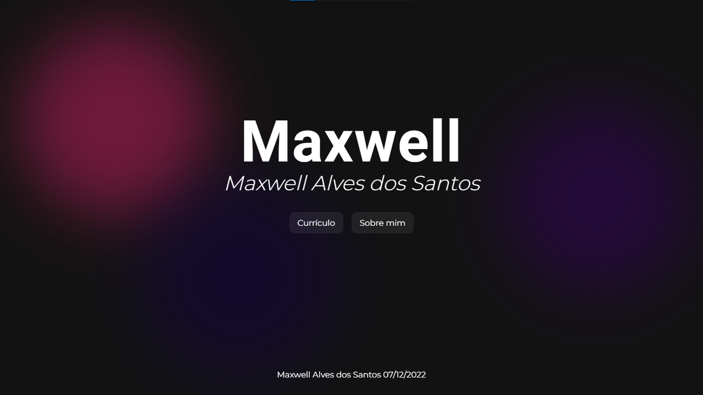

# Avaliação do módulo de HTML

## Tech4Me - Itaú

A Proposta era usar o que aprendemos nesse módulo de HTML para montar um portfólio

Não foi um projeto muito difícil de fazer, mas confesso que nunca desenvolvi um html tão semântico, e eu gostei bastante do resultado

